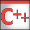

 cpp-examples
============

This is a collection of my coding mini-projects in C++.
Each solves one particular problem I encountered while
coding in C++ or studying C++.

List of projects:

- [cin_redirection](cin_redirection/)

  >An example of redirecting (emulating) std::cin

- [sqlite_connection](sqlite_connection/)

  > Steps to allow embedded database connectivity in a C++ program.

- [v8_hello_world](v8_hello_world)

  > This is a Hello World program with static linking for Google V8 engine. It is not a trivial task to build it on Windows in an *unprepared* environment due to the lack of some essential details in documentation.

Installing
------------

Each example is a Visual Studio 2015 project that can
 be built and run independently.

Documentation
-------------

- All of the code is sufficiently commented.
- There is a README and Doxygen generated documentation in each project.

License
------------
This project is licensed under the MIT License. Copyright 2018, zubrim [at] kashkan.info

