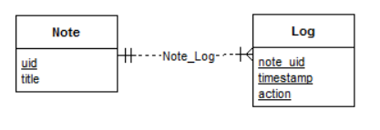

sqlite_connection
==============================================

Program Description
----------------------------------------------

This program is an example of steps to allow embedded database connectivity to a C++ program. The following has been checked:

- Downloading, building and linking Poco library
- Downloading and linking SQLite library
- Using different aspects of Poco::Data wrapper according to [Poco Data User Guide](https://pocoproject.org/docs/00200-DataUserManual.html). Particularly, the following interesting features has been tested:
    - connection, session, __binding custom objects__
    - using Poco data types (incl. [timestamps](https://pocoproject.org/docs/Poco.Timestamp.html))
    - some peculiarities of SQLite3: foreign key support
   
A database containing simple notes with logging function was implemented:

Documentation
----------------------------------------------

- All of the code is sufficiently commented.
- Doxygen generated documentation is in the __docs__ folder

Building Tips
----------------------------------------------

- __POCO__ library is needed:
    [Download complete edition](https://pocoproject.org/download/index.html)
- __SQLite__ library is needed:
    [Download 64-bit DLL (x64) and command-line tools](http://www.sqlite.org/download.html)
- Set environmental variables:
    `CPP_POCO_LIB_ROOT`,
    `CPP_SQLITE_LIB_ROOT`
- Use your modified __assets/setenv.bat__ (run as admin) to accomplish that    
        
- Build POCO on x64 (on win32 it builds without problems):
    1. in Developer Command Prompt (%comspec% /k ""C:\VS2015\Common7\Tools\VsDevCmd.bat"); cd C:\VS2015\;  run _vc/vcvarsall.bat amd64_
    2. cd poco_dir
    3. in __component__: delete not needed components 
    4. in __build_vs140.cmd__: 
        buildwin 140 build shared both *x64* samples
    5. run __build_vs140.cmd__

- Set Project Properties
    1. Configuration Properties > Debugging > Environment
        - `PATH=%PATH%;$(CPP_POCO_LIB_ROOT)\bin64\;$(CPP_SQLITE_LIB_ROOT)\;`
        - these are paths to dll libs PocoFoundation64, PocoData64, PocoDataSQLite64, sqlite3
    2. Configuration Properties > General > Output and Intermediate Directories
        - `build\$(Platform)\$(Configuration)\bin\`
        - `build\$(Platform)\$(Configuration)\obj\`
    3. C/C++ > General > Additional Include Directories
        - `$(CPP_POCO_LIB_ROOT)\Foundation\include\;$(CPP_POCO_LIB_ROOT)\Data\include\;$(CPP_POCO_LIB_ROOT)\Data\SQLite\include\;`
    4. Linker > General > Additional Library Directories
        - `$(CPP_POCO_LIB_ROOT)\lib64\;`